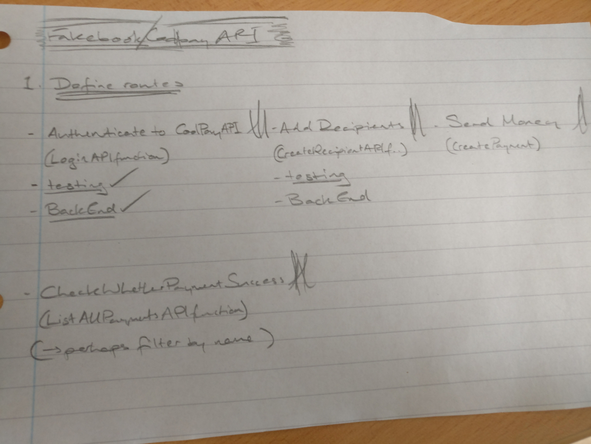
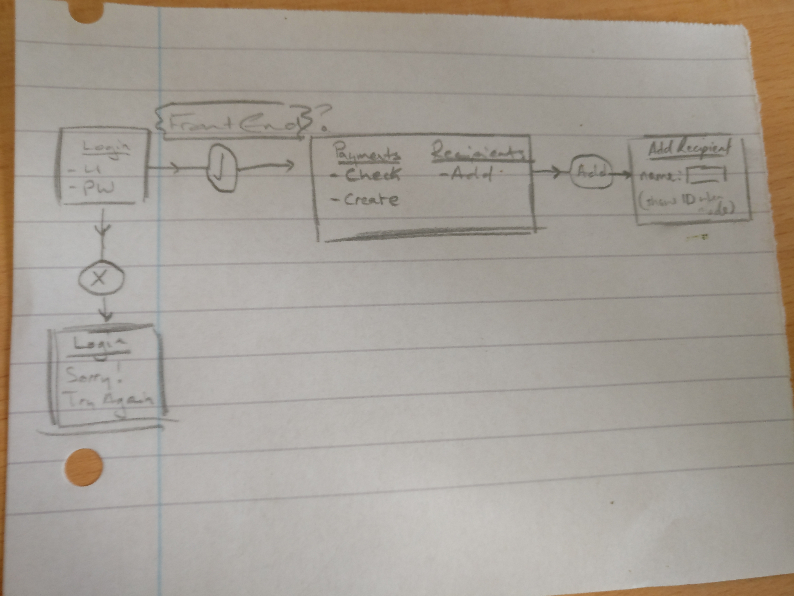

# Coolpay Integration
Integrating the CoolPay API with FakeBook
You can find Coolpay documentation here: http://docs.coolpayapi.apiary.io/.

## How to Run
- Clone this repository, and install the necessary dependencies outlined the Gemfile.
- Once done, cd into the repo and run the following command to run all tests: ```$ rspec```
- To run the server, run the command: ```$ ruby app.rb```
- Once authenticated, the user has the option to add either a recipient or payment, or check successful payments.


## Task
Write a small app that uses Coolplay API in Ruby. The app should be able do the following:
- Authenticate to Coolpay API
- Add recipients
- Send them money
- Check whether a payment was successful - filter by “paid” and by “id”

## Approach
To begin with, I made each of the four above requirements into tasks to be tackled separately, helping to organise my development into incremental stages. I wrote a test for each requirement, and then the back-end code to pass that test, to give the app a back-end scaffold.



Here, each requirement/task is written, and below the CoolPay API function I thought most suitable. After completing the back-end code, I wanted to show the results in the browser, so that it could be a complete 'app'. I used the below wireframing sketch to help guide my front-end development. The 'comic-book' approach to designing the HTML page structure helped me plan my code more easily.



In terms of architecture, the back-end is made up of 4 classes. Auth accepts usernames and apikeys, and authenticates users. The PaymentHandler deals with any requests made to the CoolPay API regarding payments, and the RecipientHandler does the same with recipients. Utils contains a set of methods that were useful in either formatting information to be sent as a request, or for extracting necessary information from responses. Because they were used in most classes, but were still generic, I felt the name utils suitable in this instance.

## Techs Used
##### sinatra
I used sinatra to write the back-end code for this task as it was a lightweight, and fairly simple to develop with. Setting up a project in sinatra took minimal config, and little templated code. Coming back into Ruby after a while, I didn't want to use a framework like Rails where I might be overwhelmed by the amount of boilerplate code - sinatra's simplicity helped me code with more clarity and more easily debug my own errors.
##### rspec
I learnt to write tests using RSpec, so when coming back to Ruby it felt natural and a bit nostalgic to use RSpec. I used the Red, Green, Refactor method to write a Red failing test, Pass it so it turns Green, and then refactor the code around it.
##### rest-client
I used rest-client to make GET and POST requests to the CoolPay API. It was recommended in the CoolPay docs, so it made sense for me to use the most conventional framework here.
##### json
This gem was used to handle the JSON responses returned from successful requests in Ruby.
##### HTML
I used just HTML for the front-end. It was the simplest way to display the responses from the CoolPay API.

## Improvements
- At the moment, the front-end is a bit simple and ugly. Also, I think there are too many pages. To improve this, I would maybe look at some Javascript methods to render payment/recipient confirmation when added, and also to render failure when logging in, rather than dedicating whole pages to these events.
- Also, when testing, I couldn't find a way to check whether a string was wrapped in double-quotes or not, which is something I would improve to make the codebase more secure.
- I think because I haven't used Ruby in a while, some of the conventions around my code might be incorrect, or borrowed from other languages. To mind, when I wanted to create variables that could be used across methods within a class, I wasn't sure whether to use constants, class variables, or class attributes. In the short term, I used what I felt worked, but I think a better solution would be figure out which of the three is best for the situation.
- In terms of returning payments to see if they were successful, at the moment the app returns all payments with a status of 'paid', and expects the user to look through the data for the entry they require. I think a better long term solution might have been to make the user able to filter the payments returned by either payment_id or recipient information.  
- Some of the tests written involve actually creating objects into CoolPay API's DB. Long term this is hugely inefficient - I should have mocked the instances where CoolPay was used in testing to avoid this.
